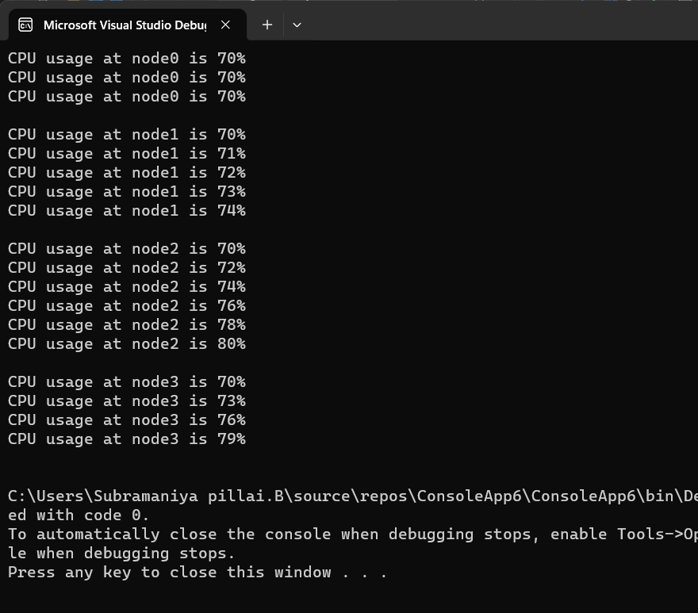

# Ex05-Rec-JaggedArray
## Aim:
To write a C# program to create a sample CPU usage on a network with 4 nodes using a jagged array.
## Algorithm:
### Step1:
Begin: Start the program.
### Step2:
Declare a Jagged Array: Create a jagged array to represent the network with four nodes.
### Step3:
Initialize the Elements: Populate the array with initial values to simulate CPU usage on each node.
### Step4:
Accessing the Elements: Use loops and indexing to access and manipulate the CPU usage values for each node within the network.
### Steps5:
Finish the program execution.

This program is designed to mimic a simple CPU usage scenario within a network of four nodes, and the jagged array is used to store and manipulate these CPU usage values.

> Developed by: Subramaniya Pillai B

> reg no: 212221230109


## Program:
```c#
using System;
class Gane
{
    public static void Main(String[] args)
    {
        int[][] array = new int[4][];
        array[0] = new int[3];
        array[1] = new int[5];
        array[2] = new int[6];
        array[3] = new int[4];
        for(int i=0; i<4; i++)
        {
            for(int j=0; j<array[i].Length; j++)
            {
                array[i][j] = i*j+70;
            }
        }
        for(int i=0; i<array.Length; i++)
        {
            for(int j=0;j<array[i].Length; j++)
            {
                Console.WriteLine("CPU usage at node"+ i +" is "+ array[i][j]+"%");
            }
            Console.WriteLine();
        }
    }
}

```

## Output:


## Result:
Thus, the C# program to create a sample CPU usage on a network with 4 nodes using a jagged array is executed successfully.
